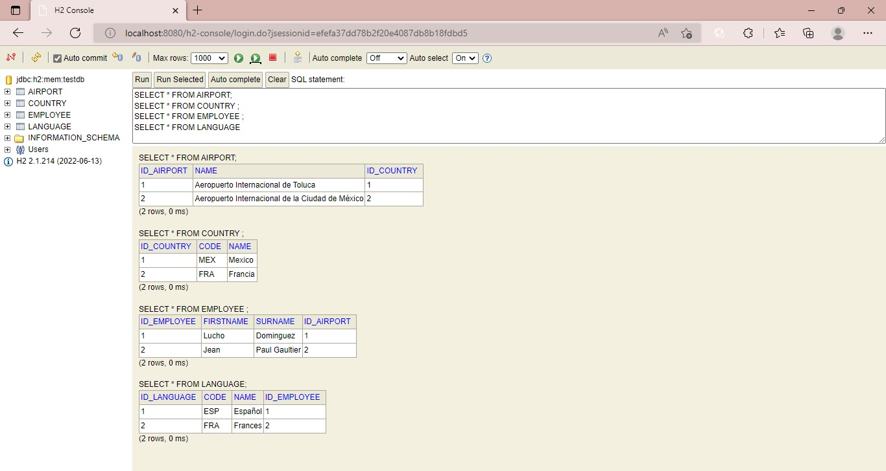

# Python - Spring: Evaluacion Parte 2
Este programa fue diseñado con Python 3.10.

## Objetivo
El programa python-spring es una segunda parte del programa [JavaSpring](https://github.com/EMcoding17/EvaluacionJava), tiene como objetivo leer el archivo src/empleados.txt, que cuenta con los siguientes datos separados por comas y saltos de linea cuando se indique un nuevo registro:
*   Nombre
*   Apellido
*   País
*   Idioma
*   Aeropuerto

Posterior a ser leídos por el programa, Python-Spring debe de generar un JSON que pueda ser publicado mediante un API-REST, a traves del end-point **/apiv1/clientes/add**.

## Ejecución

1.  Ejecutar la primer parte del programa [JavaSpring](https://github.com/EMcoding17/EvaluacionJava), que fue desarrollado mediante Java version 1.8. Es importante que este programa se mantenga en ejecución para poder realizar el insert de los datos mediante python.
2.  En el programa [Python-Spring](https://github.com/EMcoding17/EvaluacionPython-Spring), se ejecutara el archivo [main.py](https://github.com/EMcoding17/EvaluacionPython-Spring/blob/main/main.py) que se encargara de añadir los registros a las tablas:
    *   Employee
    *   Language
    *   Airport
    *   Country
3. Una vez que termina de ejecutar el archivo main.py. mostrara en la terminal una nomenclatura como la siguiente:
   **Employee-Insert: 200**
   El numero 200 puede cambiar según el estado de respuesta del servidor Spring, es decir, si se insertaron correctamente los datos mostrara 200 en caso contrario se mostrara un numero diferente, donde probablemente se genere un error.

## Funcionamiento

El archivo main.py se encarga de mandar a llamar los controladores encargados de insertar los registros a cada tabla.
### **[country.py](https://github.com/EMcoding17/EvaluacionPython-Spring/blob/main/controllers/country.py)** 

Este es el primer controlador que ejecuta main.py. Es el encargado de insertar los datos a la tabla country, desde el end-point **/Country/createCountry**. Es importante que se llene primero la tabla country, de lo contrario los datos quedarian nulos y no existiria una relacion entre las tablas y sus registros.

### **[airport.py](https://github.com/EMcoding17/EvaluacionPython-Spring/blob/main/controllers/airport.py)**
Es el segundo archivo a ejecutar, mediante el end-point **/Airport/createAirport** se encarga de insertar los registros a la tabla aeropuerto 

### **[language.py](https://github.com/EMcoding17/EvaluacionPython-Spring/blob/main/controllers/language.py)** 
Este archivo se ejecuta al mismo tiempo que employee, pero cabe señalar que es el encargado de obtener los datos de idioma, los cuales no son insertados hasta que se añadan los datos del empleado a su respectiva tabla.

### **[employee.py](https://github.com/EMcoding17/EvaluacionPython-Spring/blob/main/controllers/employee.py)**
Finalmente la ultima tabla a llenar es Employee, debido a que cuenta con un campo que hace referencia a los datos previamente insertados del aeropuerto. Su json debe de tener los campos de la tabla empleados, el id del aeropuerto al que pertenece y los datos previamente obtenidos del idioma. Para poder hacer el insert de estos registros, python realiza un **post** al end-point **/apiv1/clientes/add**

# **Resultado**

